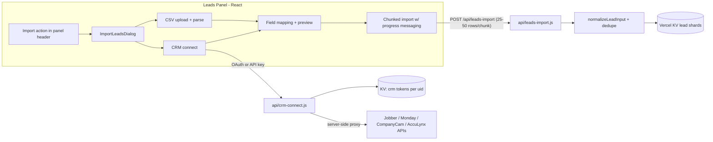

# Lead Import: CSV + CRM Connections (Phased Plan)

## Context and key findings

- **No import exists today.** Leads are created one-at-a-time via `POST /api/leads` ([api/leads.js](../../api/leads.js)), which enforces a 409 on duplicate `parcelId`. Storage is JSON blobs in Vercel KV via [api/lib/leadStore.js](../../api/lib/leadStore.js) with a KV lock ([api/lib/kvLock.js](../../api/lib/kvLock.js)) — bulk writes must go through one batched endpoint, not N single POSTs.
- **UI hook point:** [src/components/LeadsPanel.jsx](../../src/components/LeadsPanel.jsx) header (line ~259) currently has only `PanelCreateButton`. Other panels (Lists, Deals) use `OptionsMenuDropdown` — we'll add one to Leads with an "Import leads" action.
- **Design system to reuse:** Radix `Dialog` with `map-panel` styling, `showToast` ([src/components/ui/toast.jsx](../../src/components/ui/toast.jsx)), `PanelListLoadingShell`/`Loader2` spinners, CVA buttons. The batched skip-trace flow ([src/utils/leadSkipTraceSync.js](../../src/utils/leadSkipTraceSync.js), [api/skip-trace.js](../../api/skip-trace.js)) is the closest precedent for chunked progress with rate limits.
- **CRM API reality (verified against current vendor docs):**
  - **Jobber** — OAuth 2.0 sign-in, GraphQL `clients` query (`api.getjobber.com/api/graphql`). Full "sign in to connect" flow.
  - **CompanyCam** — OAuth 2.0 sign-in, REST `GET /v2/projects` (contacts live on projects as `primary_contact`).
  - **Monday.com** — OAuth 2.0 (app-scoped) or personal API token; GraphQL `boards → items_page`. Boards have arbitrary user-defined columns, so Monday imports reuse the CSV intelligent field mapper.
  - **AccuLynx** — **API key only, no OAuth.** User pastes an admin-generated key; REST `GET /api/v2/contacts` and `/jobs`. Fields are well-defined, so mapping is mostly static.
- **Operational prerequisite (user action):** OAuth requires registering a Knockscout app with Jobber (Developer Center), Monday, and CompanyCam to obtain client IDs/secrets, stored as Vercel env vars. Code can be built and tested with mocks before those credentials exist; AccuLynx and CSV have no such dependency.
- **Serverless constraint:** Vercel functions cap at 10–60s. Imports run as client-orchestrated chunks (~25–50 leads per request) against a new bulk endpoint, with progress messaging driven client-side — no job queue needed.

## Architecture

---

## Phase 1 — Import foundation (backend + UI shell)

- **New `api/leads-import.js`**: authenticated `POST` accepting `{ leads: [...], importId, dedupeMode }` (max ~50 rows/request). Reuses `normalizeLeadInput`, `normalizeLeadContactsForStorage`, tag/status resolution from [api/leads.js](../../api/leads.js). Single `mutateLeads` transaction per chunk. Returns per-row results: `created | updated | skipped-duplicate | error`.
- **Dedupe logic** in `api/lib/leadImportDedupe.js`: match existing leads by `parcelId`, normalized email, normalized phone, or normalized address; caller chooses `skip` or `merge` (fill blank fields only). Every imported lead gets `importMeta: { importId, source: 'csv'|'jobber'|..., importedAt }` so a bad import is identifiable (and bulk-deletable later).
- **UI entry point**: add `OptionsMenuDropdown` to the `PanelHeader` in [src/components/LeadsPanel.jsx](../../src/components/LeadsPanel.jsx) with an "Import leads" item (Upload icon), opening a new `src/components/leads/ImportLeadsDialog.jsx` — a nested Radix dialog styled like `CreateLeadDialog`, with a source picker screen: **CSV file**, **Jobber**, **Monday.com**, **CompanyCam**, **AccuLynx**.
- **Client utility `src/utils/leadImport.js`**: chunked upload orchestration (sequential chunks, retry-once on failure, progress callback), modeled on `applySkipTraceResultsToLeads`.

## Phase 2 — CSV import with intelligent mapping

- **Parsing**: add PapaParse (small, battle-tested, handles quoting/encodings) parsed client-side — no file ever needs server storage. Cap at ~10k rows / 5MB with a friendly error.
- **Intelligent field mapper `src/utils/leadImportMapping.js`**: auto-map columns to Knockscout fields (`firstName`, `lastName`, `address`, `phone(s)`, `email(s)`, `notes`, `status`, tags) using header-name synonyms ("Client Name", "Mobile", "Job Site Address"…) plus value sniffing (email/phone/street-address regexes on sample rows). Handles full-name splitting and multi-part addresses.
- **Mapping review UI** inside `ImportLeadsDialog`: table of detected columns → target field dropdowns, 3-row data preview, duplicate-handling choice (skip vs merge), then confirm.
- **Progress and messaging** (the "smooth and seamless" requirement): staged in-dialog progress with the existing `Loader2` spinner and rotating friendly copy — "Reading your file…", "Matching your fields…", "Importing leads 50 of 320…", "Checking for duplicates…" — followed by a results summary screen (created / merged / skipped / failed with reasons, downloadable error rows). `showToast` success on close, and `onRefreshLeads()` to repopulate the panel.

## Phase 3 — CRM connector framework + Jobber (first OAuth integration)

- **Connection storage**: tokens in KV under `crm_connections:{uid}` (access + refresh tokens, provider, account label). Never exposed to the client.
- **New `api/crm-connect.js`** (single route, `?provider=` param to stay under Vercel function limits): `GET ?action=status`, `GET ?action=authorize` (returns vendor auth URL with `state` bound to uid), `GET ?action=callback` (code→token exchange, then redirect back to app), `POST ?action=disconnect`, and `POST ?action=fetch` (server-side proxy that pulls records from the vendor and returns normalized rows to the client for preview/mapping).
- **Provider clients under `api/lib/crm/`**: `jobber.js` first — OAuth token exchange/refresh against `api.getjobber.com/api/oauth/token`, paginated GraphQL `clients` query (names, emails, phones, billing/property addresses, notes), mapped to Knockscout lead fields server-side (static mapping — Jobber's schema is fixed).
- **UI flow**: picking Jobber in `ImportLeadsDialog` → popup/redirect OAuth → "Connected as {account}" → fetch preview ("Fetching your Jobber clients…") → same preview/dedupe/progress screens as CSV.
- Client secrets via env vars (`JOBBER_CLIENT_ID/SECRET`, etc.); note in README/env docs that these must be added in Vercel and Cloud Agent secrets.

## Phase 4 — Monday.com, CompanyCam, AccuLynx connectors

- **Monday.com** (`api/lib/crm/monday.js`): OAuth (or personal-token fallback field in the dialog). After connect: board picker (GraphQL `boards` query), then fetch `items_page` items and **reuse the Phase 2 intelligent mapper** since board columns are user-defined — column titles/types feed the same mapping review UI.
- **CompanyCam** (`api/lib/crm/companycam.js`): OAuth; fetch `GET /v2/projects` (paginated), map project name/address/coordinates/`primary_contact` → lead fields. Static mapping.
- **AccuLynx** (`api/lib/crm/acculynx.js`): no OAuth exists — dialog shows a "Paste your API key" step with inline help ("Ask your AccuLynx administrator, Account Settings → API"). Key validated via a test call, stored in the same KV connection record. Fetch `GET /api/v2/contacts` (+ optional `/jobs` for addresses); static mapping with the mapper as fallback for custom fields.
- All three reuse the Phase 3 framework: connect → fetch with loading copy ("Talking to Monday.com…") → preview/mapping → dedupe → chunked import → summary.

## Phase 5 — Polish, hardening, and test coverage

- Empty-leads-panel upsell: when a user has zero leads, show an "Import your existing clients" call-to-action in the empty state alongside the current copy.
- Partial-failure UX: retry-failed-rows button on the summary screen; import interrupted mid-way resumes safely because dedupe makes re-runs idempotent.
- Rate-limit courtesy: small delay between vendor page fetches; respect Monday/Jobber complexity limits.
- Guard: block imports that would exceed any plan/lead limits if applicable.

---

## Test plan

### Automated (Vitest, runs with `npm test`)

- `src/utils/__tests__/leadImportMapping.test.js` — header-synonym mapping, value sniffing, full-name splitting, ambiguous-column behavior, malformed CSV rows.
- `src/utils/__tests__/leadImport.test.js` — chunking math, retry-once, progress callbacks, results aggregation.
- `api/lib/__tests__/leadImportDedupe.test.js` — parcelId/email/phone/address matching, skip vs merge semantics, merge never overwrites populated fields.
- `api/__tests__/leadsImport.test.js` — bulk endpoint auth, row limits, per-row result statuses, importMeta stamping.
- `api/lib/crm/__tests__/*.test.js` — per-provider response→lead mapping against recorded fixture payloads (Jobber GraphQL, Monday items, CompanyCam projects, AccuLynx contacts); token refresh logic with mocked fetch.

### Regression document (manual QA)

Add to section `05 Leads CRM` in [docs/regression-test-cases.legacy.mjs](../regression-test-cases.legacy.mjs) following the existing `tc()` format, then rebuild with `npm run regression:build`:

- `LED-IMP-001` — Import dialog opens from Leads panel options menu; source picker shows CSV + 4 CRMs.
- `LED-IMP-002` — CSV happy path: upload sample file, auto-mapped fields shown, confirm, progress messages display, all leads appear in list with correct fields.
- `LED-IMP-003` — CSV mapping override: remap a mis-detected column before import; imported data reflects override.
- `LED-IMP-004` — Duplicate handling: re-import same CSV with "skip duplicates"; summary reports skipped, no duplicate rows in list.
- `LED-IMP-005` — Duplicate handling: "merge" mode fills only blank fields on existing leads.
- `LED-IMP-006` — Bad file: non-CSV / oversized / empty file shows friendly error, no partial import.
- `LED-IMP-007` — Partial failure: file with some invalid rows imports valid rows and lists failures in summary with reasons.
- `LED-IMP-008` — Jobber OAuth connect, fetch, preview, import; "Connected as" label correct; disconnect works.
- `LED-IMP-009` — Monday connect, board picker, column mapping, import.
- `LED-IMP-010` — CompanyCam connect and project import (address/coordinates populate map pins).
- `LED-IMP-011` — AccuLynx API key: invalid key rejected with clear message; valid key imports contacts.
- `LED-IMP-012` — Interrupted import (close dialog / lose network mid-import): re-running import does not duplicate leads.
- `LED-IMP-013` — Team roles: team-member without lead-create permission cannot import (roles `ADM` on import cases).
- `LED-IMP-014` — Imported leads are fully functional: open detail, status change, outreach actions, tags.

## Sequencing and dependencies

- Phases 1–2 (CSV) are self-contained and shippable alone — no external credentials.
- Phase 3 requires Jobber developer app registration (client ID/secret in Vercel env) before live testing; code + fixture tests land first.
- Phase 4 similarly needs Monday and CompanyCam app registrations; AccuLynx needs only a test account API key.
- Phase 5 + regression doc updates land last, after live end-to-end verification of each connector.

## Implementation checklist

- [ ] Phase 1: Build `api/leads-import.js` bulk endpoint with dedupe module and importMeta stamping
- [ ] Phase 1: Add options menu to LeadsPanel header and ImportLeadsDialog shell with source picker
- [ ] Phase 2: CSV parsing (PapaParse) + intelligent field mapping utility and mapping review UI
- [ ] Phase 2: Chunked import orchestration with staged loading messages and results summary screen
- [ ] Phase 3: CRM connection framework (`api/crm-connect.js`, KV token storage) + Jobber OAuth/GraphQL connector
- [ ] Phase 4: Monday.com connector with board picker reusing field mapper
- [ ] Phase 4: CompanyCam OAuth connector mapping projects/primary contacts
- [ ] Phase 4: AccuLynx API-key connector for contacts/jobs
- [ ] Phase 5: Empty-state import CTA, retry failed rows, rate-limit courtesy, idempotent re-runs
- [ ] Phase 5: Vitest suites for mapping/dedupe/endpoint/connectors + LED-IMP regression cases and `regression:build`
