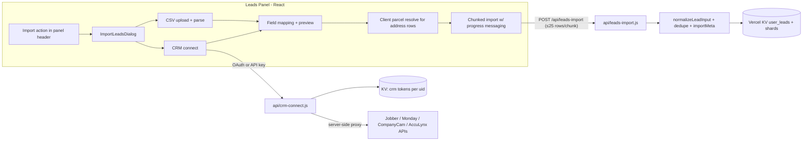

# Lead Import: CSV + CRM Connections (Phased Plan)

> Reviewed against current `main` (post–storm-map / lead-photo work). Changes from the original draft are called out in **Review notes** at the bottom.

## Context and key findings

- **No import exists today.** Leads are created one-at-a-time via `POST /api/leads` ([api/leads.js](../../api/leads.js)), which returns 409 when a visible/owned lead already has the same `parcelId`. Storage is a monolith JSON array in Vercel KV (`user_leads`) via [api/lib/leadStore.js](../../api/lib/leadStore.js) with an optional KV lock (`lock:user_leads`, 5s TTL / 2s wait). Bulk writes must go through **one** batched `mutateLeads` per chunk — not N single POSTs (each POST reloads + rewrites the full array and contends on the global lock).
- **UI hook point:** [src/components/LeadsPanel.jsx](../../src/components/LeadsPanel.jsx) header currently has only `PanelCreateButton`. Mirror **Deals / Quotes** (`PanelCreateButton` + `PanelOptionsButton` + `OptionsMenuDropdown`) — not Lists, which only use per-row menus. Empty state is text-only (“No leads yet.”) with no CTA.
- **Design system to reuse:** Radix `Dialog` with `map-panel` styling, `showToast` ([src/components/ui/toast.jsx](../../src/components/ui/toast.jsx)), `PanelListLoadingShell`/`Loader2` spinners, CVA buttons. Closest progress precedent is skip-trace toasts + job state — **not** a polished in-dialog progress UI. List skip-trace currently does **not** chunk client-side (server caps at 25 parcels and returns 413); do not copy that bug. Model chunking on an explicit client loop with a hard per-request cap.
- **Canonical create path to reuse:** `normalizeLeadInput` + `normalizeLeadContactsForStorage` + status allowlist + `mergeEntityTags` from [api/leads.js](../../api/leads.js). Client create also runs `ensureLeadParcelLink` ([src/utils/resolveLeadParcel.js](../../src/utils/resolveLeadParcel.js)) before POST — import must do the same for address-only rows or leads land without `parcelId` / map pins.
- **CRM API reality (verified against current vendor docs):**
  - **Jobber** — OAuth 2.0 sign-in, GraphQL `clients` query (`api.getjobber.com/api/graphql`). Full "sign in to connect" flow.
  - **CompanyCam** — OAuth 2.0 sign-in, REST `GET /v2/projects` (contacts live on projects as `primary_contact`).
  - **Monday.com** — OAuth 2.0 (app-scoped) or personal API token; GraphQL `boards → items_page`. Boards have arbitrary user-defined columns, so Monday imports reuse the CSV intelligent field mapper.
  - **AccuLynx** — **API key only, no OAuth.** User pastes an admin-generated key; REST `GET /api/v2/contacts` and `/jobs`. Fields are well-defined, so mapping is mostly static.
- **Operational prerequisite (user action):** OAuth requires registering a Knockscout app with Jobber (Developer Center), Monday, and CompanyCam to obtain client IDs/secrets, stored as Vercel env vars. Code can be built and tested with mocks before those credentials exist; AccuLynx and CSV have no such dependency.
- **Serverless constraint:** Most API routes have no `maxDuration` override (Hobby default ~10s / Pro ~60s). Long jobs that already exist set 30–120s in [vercel.json](../../vercel.json). Import + CRM fetch routes must declare `maxDuration` explicitly. Imports run as client-orchestrated chunks against a new bulk endpoint — no job queue needed for v1.

## Architecture

---

## Phase 1 — Import foundation (backend + UI shell)

- **New `api/leads-import.js`**: authenticated `POST` accepting `{ leads: [...], importId, dedupeMode }` with a hard cap of **25 rows/request** (align with skip-trace batch size; safer under KV lock + full-array rewrite). Reuses `normalizeLeadInput`, `normalizeLeadContactsForStorage`, tag/status resolution from [api/leads.js](../../api/leads.js). Single `mutateLeads` transaction per chunk; pass **all** created/updated leads in `changedResources` so version bumps / shared-index sync stay correct under `FLAG_LEADS_SHARDED`. Returns per-row results: `created | updated | skipped-duplicate | error` with reasons.
- **Auth / feature gate (new vs current POST):** Today `POST /api/leads` only checks Firebase auth — team `features.leads` is gated client-side via `canAccessTeamFeature` / `guardFeature`. The import endpoint **must** enforce the `leads` feature server-side (and reject when the feature is disabled for the member). Any user who can create a lead can import; there is no separate “import permission.”
- **Ownership & sharing defaults:** Each created lead gets `ownerId` / `ownerEmail` of the importing user (same as single create). Apply the same visibility defaults as [CreateLeadDialog](../../src/components/CreateLeadDialog.jsx): private by default, or active-team `teamShares` when the importer chooses “share with team” in the import confirm step (optional v1 toggle; default private is fine).
- **Contacts:** Stamp imported phones/emails with source `'user'` (existing `CONTACT_SOURCE_USER`). Do not invent a new source enum in v1 unless product wants an “Imported” badge later.
- **Activity logging:** Do **not** write 25× `lead.created` activity entries per chunk. Prefer one `lead.import` summary activity per chunk (or per full importId) with counts; optionally skip per-row activity entirely for imports.
- **Tags / status:** Unknown `tagIds` currently 400 the whole create. For import: drop unknown tags with a per-row warning, or only accept tags that exist in the user’s registry — **do not auto-create tags in v1**. Invalid status values fall back to `'new'` (with a warning) rather than failing the row, matching the create default when status is omitted.
- **Dedupe logic** in `api/lib/leadImportDedupe.js`:
  - Match order: exact `parcelId` → normalized email → normalized phone → normalized address string.
  - Align parcel matching with client `findLeadByParcelId` where practical (property IDs / coords), not only string equality.
  - Caller chooses `skip` or `merge` (fill blank fields only — never overwrite populated name/contact/address/status).
  - **Visibility loophole to close for import:** current POST 409 only fires when the conflicting lead is visible to or owned by the caller. Import must treat **any** existing lead with the same `parcelId` (global scan of `getAllLeads`) as a duplicate: `skip` / `merge` if the caller can access it; otherwise `error` with a clear “parcel already claimed” reason — do not silently create a second lead on the same parcel.
  - Every imported/updated lead gets `importMeta: { importId, source: 'csv'|'jobber'|..., importedAt, rowIndex? }` so a bad import is identifiable (and bulk-deletable later).
- **Rate limit:** Per-user daily import row cap via existing [api/lib/rateLimit.js](../../api/lib/rateLimit.js) (start at **2,000 rows/day**; tune later). Return 429 with a friendly message.
- **Vercel config:** Register `api/leads-import.js` with `maxDuration: 60` in [vercel.json](../../vercel.json).
- **UI entry point:** Add `PanelOptionsButton` + `OptionsMenuDropdown` beside `PanelCreateButton` in [src/components/LeadsPanel.jsx](../../src/components/LeadsPanel.jsx) (copy the Deals panel pattern, including `onInteractOutside` guard for the menu). Menu item: “Import leads” (Upload icon) → `src/components/leads/ImportLeadsDialog.jsx` — nested Radix dialog styled like `CreateLeadDialog`, source picker: **CSV file**, **Jobber**, **Monday.com**, **CompanyCam**, **AccuLynx**.
- **Client utility `src/utils/leadImport.js`**: chunked upload orchestration (sequential chunks of ≤25, retry-once on 5xx/network, no retry on 4xx row errors, progress callback). Aggregate per-row results across chunks.

## Phase 2 — CSV import with intelligent mapping

- **Parsing:** add PapaParse (not currently in `package.json`) — parse client-side so no file is stored on the server. Cap at **~5,000 rows / 5MB** with a friendly error (10k is ambitious for monolith KV rewrite + lock; raise later if needed).
- **Intelligent field mapper `src/utils/leadImportMapping.js`:** auto-map columns to Knockscout fields (`firstName`, `lastName`, `address`, `phone(s)`, `email(s)`, `notes`, `status`, tags) using header-name synonyms ("Client Name", "Mobile", "Job Site Address"…) plus value sniffing (email/phone/street-address regexes on sample rows). Handles full-name splitting and multi-part addresses.
- **Parcel prep (required):** After mapping, for rows with an address but no `parcelId`, run the same client path as create (`ensureLeadParcelLink` / geocode + land-records resolve) **before** chunked upload — either sequentially with progress (“Linking parcels 12 of 80…”) or in a small concurrency pool (2–4). Rows that only get lat/lng still import (warning), matching CreateLeadDialog behavior.
- **Mapping review UI** inside `ImportLeadsDialog`: table of detected columns → target field dropdowns, 3-row data preview, duplicate-handling choice (skip vs merge), optional “share new leads with my team” toggle when an active team exists, then confirm.
- **Progress and messaging** (the "smooth and seamless" requirement): staged in-dialog progress with `Loader2` and rotating friendly copy — "Reading your file…", "Matching your fields…", "Linking parcels…", "Importing leads 50 of 320…", "Checking for duplicates…" — followed by a results summary (created / merged / skipped / failed with reasons, downloadable error CSV). `showToast` success on close; call `onRefreshLeads()` to repopulate the panel.

## Phase 3 — CRM connector framework + Jobber (first OAuth integration)

- **Connection storage:** tokens in KV under `crm_connections:{uid}` (access + refresh tokens, provider, account label, scopes, expiry). Never expose tokens to the client. Use `withKvLock` on read-modify-write (refresh / disconnect). Treat as secrets: document that KV access implies CRM access; prefer encrypting at rest with a server-only `CRM_TOKEN_SECRET` if low-effort (AES-GCM); otherwise plaintext KV is acceptable for v1 **only** if documented as a known risk and access to KV is tightly controlled.
- **OAuth security (greenfield — no existing CRM callback pattern):**
  - `state` = HMAC-signed payload `{ uid, provider, nonce, exp }` using a dedicated secret (or reuse `PREVIEW_LINK_SECRET` pattern from [api/lib/previewToken.js](../../api/lib/previewToken.js) — fail closed in production).
  - Prefer PKCE where the vendor supports it (Jobber / Monday / CompanyCam).
  - Short TTL on `state` (≤10 minutes); single-use nonce stored in KV until callback.
  - Callback must verify `state` before exchanging the code; redirect back to the app with a success/error query flag only (no tokens in the URL).
- **New `api/crm-connect.js`** (single route, `?provider=` param to stay under Vercel function limits): `GET ?action=status`, `GET ?action=authorize` (returns vendor auth URL), `GET ?action=callback` (code→token exchange, then redirect), `POST ?action=disconnect`, `POST ?action=fetch` (server-side proxy that pulls records and returns normalized rows for preview/mapping). Register `maxDuration: 60` (120 if vendor pagination is slow).
- **Provider clients under `api/lib/crm/`:** `jobber.js` first — OAuth token exchange/refresh against `api.getjobber.com/api/oauth/token`, paginated GraphQL `clients` query (names, emails, phones, billing/property addresses, notes), mapped to Knockscout lead fields server-side (static mapping — Jobber’s schema is fixed). Respect vendor rate/complexity limits with small delays between pages.
- **UI flow:** Jobber in `ImportLeadsDialog` → popup/redirect OAuth → "Connected as {account}" → fetch preview ("Fetching your Jobber clients…") → same parcel-prep / preview / dedupe / progress screens as CSV.
- Env vars: `JOBBER_CLIENT_ID`, `JOBBER_CLIENT_SECRET`, `CRM_OAUTH_STATE_SECRET` (or documented reuse), optional `CRM_TOKEN_SECRET`. Document in `.env.example` and README; add to Vercel + Cloud Agent secrets before live testing.

## Phase 4 — Monday.com, CompanyCam, AccuLynx connectors

- **Monday.com** (`api/lib/crm/monday.js`): OAuth (or personal-token fallback field in the dialog). After connect: board picker (GraphQL `boards` query), then fetch `items_page` items and **reuse the Phase 2 intelligent mapper** since board columns are user-defined — column titles/types feed the same mapping review UI.
- **CompanyCam** (`api/lib/crm/companycam.js`): OAuth; fetch `GET /v2/projects` (paginated), map project name/address/coordinates/`primary_contact` → lead fields. Static mapping. Prefer vendor lat/lng when present to skip or shortcut parcel geocode.
- **AccuLynx** (`api/lib/crm/acculynx.js`): no OAuth — dialog shows “Paste your API key” with inline help (“Ask your AccuLynx administrator, Account Settings → API”). Key validated via a test call, stored in the same KV connection record (never returned to the client after save). Fetch `GET /api/v2/contacts` (+ optional `/jobs` for addresses); static mapping with the mapper as fallback for custom fields.
- All three reuse the Phase 3 framework: connect → fetch with loading copy → preview/mapping → parcel prep → dedupe → chunked import → summary.

## Phase 5 — Polish, hardening, and test coverage

- Empty-leads-panel upsell: when `leads.length === 0`, show “Import your existing clients” CTA in the empty state (alongside create copy) that opens the same dialog.
- Partial-failure UX: retry-failed-rows button on the summary screen; interrupted imports resume safely because dedupe + `importId` make re-runs idempotent under `skip` / `merge`.
- Rate-limit courtesy: small delay between vendor page fetches; respect Monday/Jobber complexity limits.
- **Lead-count quotas:** none exist today (only per-lead photo/file storage caps). Do **not** invent a plan-limit guard in v1; if billing quotas land later, hook the import endpoint then.
- KV / scale note for implementers: each chunk rewrites the full `user_leads` array under a global lock. Very large tenants may need smaller chunks or future shard-primary writes (`FLAG_LEADS_SHARDED`); keep the client chunk size configurable (default 25).

---

## Test plan

### Automated (Vitest, runs with `npm test`)

- `src/utils/__tests__/leadImportMapping.test.js` — header-synonym mapping, value sniffing, full-name splitting, ambiguous-column behavior, malformed CSV rows.
- `src/utils/__tests__/leadImport.test.js` — chunking math (≤25), retry-once on 5xx, no retry on 4xx, progress callbacks, results aggregation.
- `api/lib/__tests__/leadImportDedupe.test.js` — parcelId/email/phone/address matching, skip vs merge semantics, merge never overwrites populated fields, inaccessible parcelId conflict → error (not silent create).
- `api/__tests__/leadsImport.test.js` — bulk endpoint auth, feature gate, row limits, rate limit, per-row result statuses, importMeta stamping, `changedResources` completeness, activity summary (not N× lead.created).
- `api/lib/crm/__tests__/*.test.js` — per-provider response→lead mapping against recorded fixture payloads (Jobber GraphQL, Monday items, CompanyCam projects, AccuLynx contacts); token refresh + OAuth `state` verification with mocked fetch.

### Regression document (manual QA)

Add cases to section `05` (Leads CRM) in [docs/regression-test-cases.legacy.mjs](../regression-test-cases.legacy.mjs) using `tc()` + `IN` / `ADM` role helpers from [docs/regression-test-schema.mjs](../regression-test-schema.mjs), then rebuild with `npm run regression:build` (legacy → generated [docs/regression-test-cases.mjs](../regression-test-cases.mjs) → HTML). Do **not** hand-edit the generated file.

- `LED-IMP-001` — Import dialog opens from Leads panel options menu; source picker shows CSV + 4 CRMs. Roles: `IN`.
- `LED-IMP-002` — CSV happy path: upload sample file, auto-mapped fields shown, confirm, progress messages display (including parcel linking), all leads appear with correct fields. Roles: `ADM` (create).
- `LED-IMP-003` — CSV mapping override: remap a mis-detected column before import; imported data reflects override. Roles: `ADM`.
- `LED-IMP-004` — Duplicate handling: re-import same CSV with "skip duplicates"; summary reports skipped, no duplicate rows. Roles: `ADM`.
- `LED-IMP-005` — Duplicate handling: "merge" mode fills only blank fields on existing leads. Roles: `ADM`.
- `LED-IMP-006` — Bad file: non-CSV / oversized / empty file shows friendly error, no partial import. Roles: `IN`.
- `LED-IMP-007` — Partial failure: file with some invalid rows imports valid rows and lists failures with reasons. Roles: `ADM`.
- `LED-IMP-008` — Jobber OAuth connect, fetch, preview, import; "Connected as" label correct; disconnect works. Roles: `ADM`.
- `LED-IMP-009` — Monday connect, board picker, column mapping, import. Roles: `ADM`.
- `LED-IMP-010` — CompanyCam connect and project import (address/coordinates populate map pins). Roles: `ADM`.
- `LED-IMP-011` — AccuLynx API key: invalid key rejected with clear message; valid key imports contacts. Roles: `ADM`.
- `LED-IMP-012` — Interrupted import (close dialog / lose network mid-import): re-running import does not duplicate leads. Roles: `ADM`.
- `LED-IMP-013` — Team member with `features.leads` disabled cannot open import / API returns forbidden; member with leads enabled can import. Roles: `IN` (needs a team fixture with feature off). *Not* a generic “non-admin cannot import” rule — members can create leads when the feature is on.
- `LED-IMP-014` — Imported leads are fully functional: open detail, status change, outreach actions, tags. Roles: `ADM`.
- `LED-IMP-015` — Empty-state “Import your existing clients” CTA opens the dialog. Roles: `IN`.

## Sequencing and dependencies

- Phases 1–2 (CSV) are self-contained and shippable alone — no external credentials. **Ship CSV first.**
- Phase 3 requires Jobber developer app registration (client ID/secret in Vercel env) before live testing; code + fixture tests land first.
- Phase 4 similarly needs Monday and CompanyCam app registrations; AccuLynx needs only a test account API key.
- Phase 5 + regression doc updates land last, after live end-to-end verification of each connector (CSV regression can land with Phase 2).

## Implementation checklist

- [ ] Phase 1: Build `api/leads-import.js` bulk endpoint (≤25 rows) with dedupe module, importMeta, feature gate, rate limit, activity summary, `maxDuration: 60`
- [ ] Phase 1: Add `PanelOptionsButton` + options menu to LeadsPanel header and ImportLeadsDialog shell with source picker
- [ ] Phase 2: Add PapaParse; CSV parsing + intelligent field mapping utility and mapping review UI
- [ ] Phase 2: Client parcel linking (`ensureLeadParcelLink`) with progress before upload
- [ ] Phase 2: Chunked import orchestration with staged loading messages and results summary screen
- [ ] Phase 3: CRM connection framework (`api/crm-connect.js`, locked KV token storage, HMAC `state` + PKCE) + Jobber OAuth/GraphQL connector
- [ ] Phase 3: Document env vars in `.env.example` / README
- [ ] Phase 4: Monday.com connector with board picker reusing field mapper
- [ ] Phase 4: CompanyCam OAuth connector mapping projects/primary contacts
- [ ] Phase 4: AccuLynx API-key connector for contacts/jobs
- [ ] Phase 5: Empty-state import CTA, retry failed rows, rate-limit courtesy, idempotent re-runs
- [ ] Phase 5: Vitest suites for mapping/dedupe/endpoint/connectors + LED-IMP regression cases and `regression:build`

---

## Review notes (changes from original draft)

Validated against the live codebase; these are the substantive plan edits:

1. **Batch size ≤25** (was ~25–50) — global `mutateLeads` lock + full `user_leads` rewrite make larger chunks risky under default timeouts.
2. **Parcel linking is required** before upload for address-only rows — CreateLeadDialog already does this; without it, imported leads miss map pins / `parcelId` dedupe.
3. **UI pattern = Deals/Quotes** (`PanelOptionsButton` + menu), not Lists.
4. **Server-side `features.leads` gate** on the import API; clarify that team members *can* import when the feature is enabled (LED-IMP-013 rewritten).
5. **Close the parcelId visibility loophole** for import (no silent duplicate when another user’s private lead owns the parcel).
6. **Activity log summary** instead of N× `lead.created`; unknown tags dropped with warning; bad status → `'new'`.
7. **Daily rate limit** (2,000 rows) and explicit `vercel.json` `maxDuration`.
8. **OAuth `state` HMAC + PKCE + locked token storage** spelled out (no existing CRM OAuth infra).
9. **CSV cap 5k rows / 5MB**; PapaParse called out as a new dependency.
10. **No invented plan/lead quotas** — none exist today.
11. **Regression source of truth** is `regression-test-cases.legacy.mjs` + `regression:build`, not hand-editing the generated file.
12. **Skip-trace is a weak progress precedent** — list flow does not chunk; import must implement its own client chunk loop.
